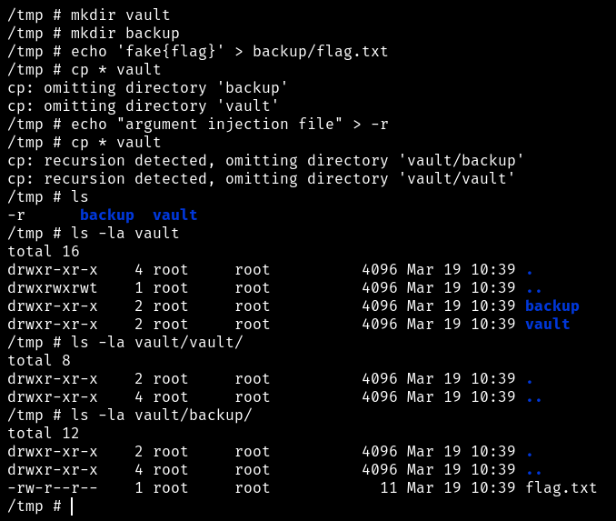
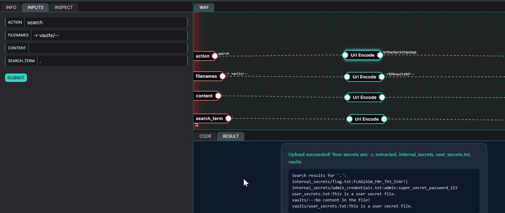

+++
title = 'Dojo 49'
date = 2026-04-01
draft = false
+++

# Code Analysis
Lets start with code analysis.

The application is declaring the variables for the directory
```python
UPLOAD_FOLDER = '/tmp/uploads'
VAULT_FOLDER = '/tmp/uploads/vaults'
```

In this snippet the `autoescape=True` is set,  which automatically converts the special character to safe html entities so SSTI is not possible. 
```python
template = Environment(
    autoescape=True,
    loader=FileSystemLoader('/tmp/templates'),
).get_template('index.html')
```

In this snippet, the `get_files_list()` function is just listing the `/tmp/uploads` directory using `os.listdir`
```python
def get_files_list():
    if not os.path.exists(UPLOAD_FOLDER):
        return []
    return sorted(os.listdir(UPLOAD_FOLDER))
```

In this snippet, the `main()` function is checking for path traversal in the filenames.
```python
if not filenames:
        message = "Error: No filename provided"
        error = True
    else:
        for filename in filenames:
            if filename.startswith('/'):
                message = "Error: the filename cannot start with '/'"
                error = True
                break
            elif '\\' in filename or '..' in filename:
                message = "Error: Invalid filename"
                error = True
                break
```

If the file name is passed the checks below code will create a file with the provided `filename` in the `/tmp/uploads` directory and write the provided `contents` to that particular file
```python
if not error:
            for filename in filenames:
                file_path = os.path.join(UPLOAD_FOLDER, filename)
                with open(file_path, "w") as f:
                    f.write(content if content else "No content in the file!")
            
            # Backing up the changes to vaults
            os.chdir(UPLOAD_FOLDER)
            os.system(f'cp * {VAULT_FOLDER} 2>/dev/null')
            os.chdir('/tmp')
            
            file_list = get_files_list()
            message = f"Upload succeeded! Your secrets are: {', '.join(file_list)}"
```

After that, the application changes to `/tmp/uploads` directory and copy every file to `/tmp/uploads/vaults` directory using `cp * /tmp/vaults 2>/dev/null`. 
```python
os.chdir(UPLOAD_FOLDER)
            os.system(f'cp * {VAULT_FOLDER} 2>/dev/null')
            os.chdir('/tmp')
```

Then the application has two actions `viewFile` and `search`.

`viewFile`
```python
if act == 'viewFile':
                        for filename in filenames:
                            # Just in case user tries to read the file from internal_secrets folder...
                            if 'internal_secrets' in filename:
                                results.append(f"ERR: Access denied to '{filename}'")
                                continue
                            for file in os.listdir(VAULT_FOLDER):
                                if file == filename:
                                    vault_file_path = os.path.join(VAULT_FOLDER, file)
                                    try:
                                        with open(vault_file_path, 'r') as f:
                                            file_content += f"Content of '{file}':\n{f.read()}\n"
                                        results.append(f"Viewed file '{file}'")
                                    except:
                                        results.append(f"ERR: could not read the file '{file}'")
                                    break
```
It will get the provided `filename` and check whether there is `internal_secrets` string in the `filename` to prevents as from reading the flag.txt. If there is no particular string the application changes the directory to `/tmp/uploads/vaults` and read the file and append its contents to `results`.

`search`
```python
elif act == 'search':
                        if grep:
                            if re.fullmatch(r'[a-zA-Z0-9.]+', grep):
                                os.chdir(VAULT_FOLDER)
                                # We just moved from GNU to BusyBox, our developers are on it.
                                result = os.popen(f'grep -r "{grep}" * --exclude-dir=internal_secrets 2>/dev/null').read()
                                os.chdir('/tmp')
                                
                                if result:
                                    file_content += f"Search results for '{grep}': \n{result}"
                                    results.append("Search completed")
                                else:
                                    results.append("No results found")
                            else:
                                results.append("Error: Search term contains illegal characters")
                        else:
                            results.append("No search term provided")
```
The `search` action first check the provided `search_term` value to match only numbers, alphabets and `.`  using the regex. If the regex match is successful the application changes the directory to `/tmp/uploads/vaults` and use `grep -r {search_term} * --exclude-dir=internal_secrets 2>/dev/null` shell command to grep for the user provided `search term` in all the file in `/tmp/uploads/vaults` folder and append it to `results`. This `grep` command excludes the `internal_secrets` directory to prevent us from reading the flag.

Finally, it is appending all the message, error, file list, and content to the `index.html` template.
```
files = ' '.join(get_files_list())
    print(template.render(message=message, error=error, files=files, file_content=file_content))
```

# Exploitation
From the code analysis I found that the implementation of the `cp` and `grep` command with wildcard is insecure where users can create a file which looks like an argument such as `-r` and `--parents` etc.. This allowed me do a recursive copy by creating a filenamed `-r`. 

Initially the `cp` command copy all files using `*` but as the `internal_secrets` is a directory copy command will omit the directories and copy only the files to `/tmp/uploads/vaults` but due that found argument injection via file creation we can make the command to do recursive copy.


We got the way to copy the `flag.txt`. But how we are going to read it. We can use `viewFile` to read the flag but this action checks whether the filename contain the string `internal_secrets` if so the `viewFile` will directly produce `Access denied` error. 
```python
if 'internal_secrets' in filename:
                                results.append(f"ERR: Access denied to '{filename}'")
                                continue
```
Also the file which we specify in the `filename` will be over written so viewFile is not the way to read the flag.

We can use the `search` action to grep for flag in the `/tmp/uploads/vaults` directory but `--exclude-dir=internal_secrets` will make the `grep` command to omit the `internal_secrets` directory where the secret lies. But we can use `--` flag which make the `grep` to interpret arguments after the `--` as the files.

So if we create a file with name `vaults/--` `grep`  command with wildcard will treat everything after the payload as filename so `--exclude-dir` argument will be treated as file name.

# PoC
Now Putting everything together, we can enter the following in the respective places to get the flag.
```
Action = search
Filenames = -r vaults/--
Content = 
Search_Term = .
```


```
Flag = FLAG{A1m_F0r_Th3_St4r!}
```

