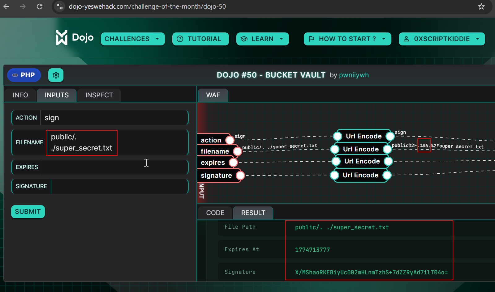
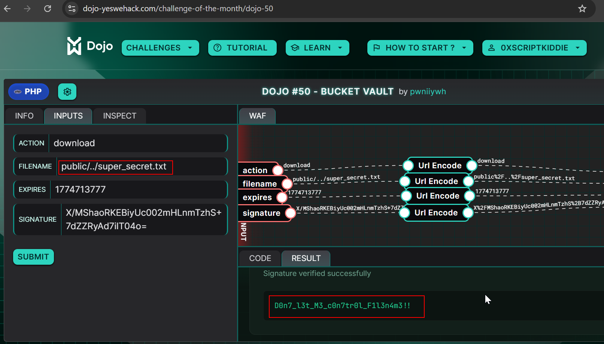

+++
title = 'Dojo 50'
date = 2026-04-29
draft = false
+++

# Code Analysis
Lets start with the code analysis.

AWS keys and user inputs are define at the starting of the code.
```php
/** Configuration **/
define('AWS_SECRET_KEY', $secrets->AWS_SECRET_KEY);
define('AWS_ACCESS_KEY', $secrets->AWS_ACCESS_KEY);
define('AWS_REGION', 'us-east-1');
define('BUCKET_NAME', 'ywh-secure-bucket');
define('EXPIRES_IN', 3600);
define('FILES_DIR', 'files');

/** User inputs **/
$action    = urldecode("");
$filename  = urldecode("");
$expires   = urldecode("");
$signature = urldecode("");
``` 

`sanitizeFilename` function removes all the ascii control characters such as `newline`,`null`,`tab` etc..
```php
function sanitizeFilename($filename) {
    return preg_replace('/[\x00-\x1F\x7F]/', '', $filename);
}
``` 

`generatePresignedUrl` function get the `file_path`,`secert_key` and `expires_in` arguments and returns the signature and the expiry time for the signature. Before signing the file the function sanitize the file name by `sanitizeFilename` function.
```php
function generatePresignedUrl($file_path, $secret_key, $expires_in) {
    $file_path = sanitizeFilename($file_path);
    $timestamp = time() + $expires_in;
    $string_to_sign = "GET\n/files/{$file_path}\n{$timestamp}";
    $signature = base64_encode(hash_hmac('sha256', $string_to_sign, $secret_key, true));

    return [
        'expires'    => $timestamp,
        'signature'  => $signature,
    ];
}
```

`verifySignature` function gets the `filename`,`expires`,`signature`,`secret_key` as arguments and verifies the provided signature by matching the provided signature by actual signature.
```php
function verifySignature($filename, $expires, $signature, $secret_key) {
    if (time() > $expires) {
        return ['valid' => false, 'error' => 'Signature expired.'];
    }

    $string_to_sign = "GET\n/files/{$filename}\n{$expires}";
    $expected_signature = base64_encode(hash_hmac('sha256', $string_to_sign, $secret_key, true));

    if (!hash_equals($expected_signature, $signature)) {
        return ['valid' => false, 'error' => 'Invalid signature.'];
    }

    return ['valid' => true];
}
```

`getFileContents` function get the `filename` and constructs the file path by adding the `FILES_DIR` which is `files`.Then verifies whether the path is exists if so it will get the contents of the file and returns the output.
```php
function getFileContents($filename) {
    $file_path = FILES_DIR . '/' . $filename;

    if (!is_file($file_path)) {
        return ['found' => false, 'error' => 'File not found.'];
    }

    return [
        'found'   => true,
        'file'    => $filename,
        'path'    => $file_path,
        'size'    => filesize($file_path),
        'mime'    => 'application/octet-stream',
        'content' => file_get_contents($file_path),
        'b64'     => base64_encode(file_get_contents($file_path)),
    ];
}
```

The application has two actions `download` and `sign`.

`download` action will pass the `filename`, `expires`, `signature` from the user input along with the AWS secret key to `verifySignature` function and verifies whether the provided signature is valid. If the signature check is passed it will pass the `filename` to `getFileContents` function and fetch the contents of the user provided file.
```php
if ($action === 'download') {
    $verification = verifySignature($filename, $expires, $signature, AWS_SECRET_KEY);

    if (!$verification['valid']) {
        $result = 'error';
        $error  = $verification['error'];
    } else {
        $file_data = getFileContents($filename);

        if (!$file_data['found']) {
            $result = 'error';
            $error  = $file_data['error'];
        } else {
            $result = 'download';
            $data   = $file_data;
        }
    }
```

`sign` action get the `filename` input from the user and check there is not `..` present in the filename to avoid path traversal and then checks whether the `filename` starts with `public/` to restrict the users from internal files. If every check is passed the `filename` and `expires_in` inputs from user is sent to `generatePresignedUrl` function  to get the signature and prints out the signature.
```php
elseif ($action === 'sign') {
    if (str_contains($filename, '..')) {
        $result = 'error';
        $error  = 'Forbidden chars in filename.';
    } elseif (!str_starts_with($filename, 'public/')) {
        $result = 'error';
        $error  = 'Access denied. Signing is restricted to the public/ prefix.';
    } else {
        $presigned = generatePresignedUrl($filename, AWS_SECRET_KEY, EXPIRES_IN);
        $result    = 'generated';
        $data      = [
            'file'      => $filename,
            'expires'   => $presigned['expires'],
            'signature' => $presigned['signature'],
        ];
    }
}
```

Finally it prints the output to the html page in the runner script
```php
print(build_html($result, $error, $data, EXPIRES_IN));
```

# Exploitation
During the analysis i found that there is a logic mistake in the that when we give a `filename` in `sign` action. The function will first check whether there is `..` in the `filename` and pass it to `generatePresignedUrl` in which `sanitizeFilename` is called.

Here if the use filename like `public/../super_secret.txt` the application will give `Forbidden chars in filename.` error but if we use `public/.\n./super_secret.txt` the `..` check will be passed as there is `\n` character between `..`. Then when the `public/.\n./super_secret.txt` is passed to `sanitizeFilename` function this will remove the `\n` character from the `filename` and `filename` becomes `public/../super_secret.txt`. We get the path traversal successfully and signature for `public/../super_secret.txt`.

When we use the `download` action with `filename` as `public/../super_secret.txt` and `signature` ,`expire` from the sign action output we can get the flag successfully.

# POC
1. Enter the action `sign` with `filename = public/.[new line]./super_secret.txt`

2. Now use the `download` with `filename = public/../super_secret.txt` and `signature`,`expires` from the previous `sign` action output.

3. We successfully read the flag `D0n7_l3t_M3_c0n7tr0l_F1l3n4m3!!`.